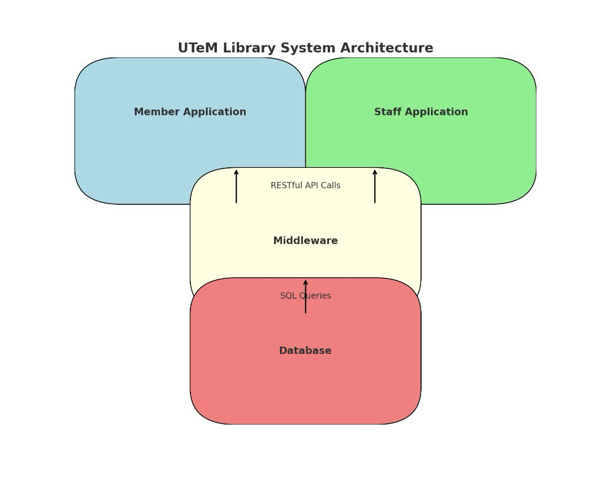

# UTeM Library System

## Overview

This project is a library management system for UTeM, which includes functionalities for both members and staff to manage book borrowings and returns.

## Applications Involved

1. Member Client Application
   - Allows university members to log in, register, borrow books, return books, and view their borrowing history.

2. Staff Client Application
   - Allows library staff to view borrowed books and returns, and approve member registration requests.

3. PHP Server with Database
   - Handles the logic and database operations, providing RESTful API endpoints for the client applications.

## Architecture Diagram

## URL Endpoints (PHP Server)

### Member Endpoints

- Log In: GET /LibraryServer.php?action=login&username={username}&password={password}
- Register: POST /LibraryServer.php?action=register
- Borrow Book: POST /LibraryServer.php?action=borrowBook&memberID={memberID}&bookID={bookID}
- Return Book: POST /LibraryServer.php?action=returnBook&memberID={memberID}&bookID={bookID}
- View Borrow History: GET /LibraryServer.php?action=viewBorrowHistory&memberID={memberID}
- Retrieve Borrowed Books: GET /LibraryServer.php?action=retrieveBorrowedBooksByMember&memberID={memberID}

### Staff Endpoints

- View Borrowed Books: GET /LibraryServer.php?action=viewBorrowedBooks
- View Returned Books: GET /LibraryServer.php?action=viewReturnedBooks
- Pending Member Registrations: POST /LibraryServer.php?action=viewPendingRegistrations
- Approve Member: POST /LibraryServer.php?action=approveMember&memberID={memberID}
- Reject Member: POST /LibraryServer.php?action=rejectMember&memberID={memberID}
- Retrieve Pending Members: GET /LibraryServer.php?action=retrievePendingMember

## Middleware Functions/Features

- User Authentication: Validates user credentials and manages sessions.
- Book Management: Handles book borrow and return operations, updates book availability.
- Member Management: Manages member registrations and approvals.
- Data Retrieval: Provides endpoints to retrieve borrowing history, current borrowings, and member details.

## Database and Tables

### Tables

- Members Table
  - memberID (INT, PRIMARY KEY)
  - username (VARCHAR)
  - password (VARCHAR)
  - memberStatus (ENUM: 'PENDING', 'APPROVED')

- Books Table
  - BookID (INT, PRIMARY KEY)
  - Title (VARCHAR)
  - ISBN (VARCHAR)
  - PublishedYear (YEAR)
  - Category (VARCHAR)
  - copiesAvailable (INT)

- borrowedbook Table
  - id (INT, PRIMARY KEY)
  - Title (VARCHAR)
  - ISBN (VARCHAR)
  - dateBorrowed (DATE)
  - status (ENUM: 'ONGOING', 'RETURNED')

## Project Structure

### Member Client Application

- Login Functionality: Allows only the approved members to log in.
- Registration Functionality: Allows new members to register; their status is set to PENDING until approved by staff.
- Borrow Book: Allows members to search for books and borrow them.
- Return Book: Allows members to return borrowed books, highlighting overdue books that had been more than 3 days.
- View Borrow History: Displays the borrowing history of the member.

### Staff Client Application

- View Borrowed Books: Allows staff to search and view currently borrowed books.
- View Returned Books: Allows staff to search and view returned books.
- Pending Member Registrations: Allows staff to view, approve or reject pending member registration requests.

### PHP Server

- Handles API Requests: Manages the logic for handling requests from both member and staff client applications.
- Interacts with the Database: Performs CRUD operations on the database based on client requests.
- Authentication: Validates user credentials during login.
- Book Borrowing and Returning: Manages the logic for borrowing and returning books, including updating book availability.

### Database

- phpMyAdmin: Stores data related to members, books, and borrowings.
- Tables: Includes tables for members, books, and borrowings.

## How to Run

1. Setup Database:
   - Use the provided SQL script(projectdad.sql) to set up the database schema and initial data.

2. Configure PHP Server:
   - Ensure the PHP server has access to the database and the correct configuration in (LibraryServer.php).

3. Run Client Applications:
   - Execute the member and staff client applications on different machines or environments as needed.

IMPORTANT NOTES: 
1. For PHP Server side, turn off the firewall.
2. Change the URL IP address, insert the PHP Server Side IP address.

PRESENTATION VIDEO LINK:
https://youtu.be/L2VRwVZsi5k
